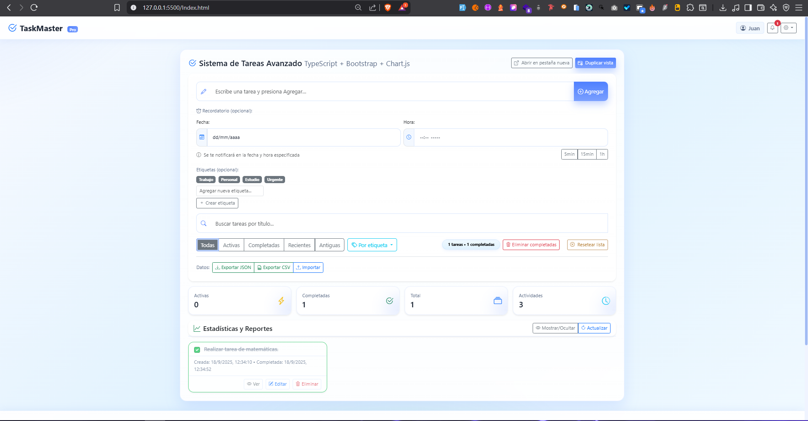

# 📋 TaskMaster Pro



## 🎓 Información del Proyecto

**TaskMaster Pro** es un sistema avanzado de gestión de tareas desarrollado por estudiantes de la **Universidad Libre** con fines académicos y de aprendizaje. Este proyecto demuestra la implementación de tecnologías web modernas y buenas prácticas de desarrollo de software.

### 🏫 Institución
**Universidad Libre** - Proyecto Académico de Desarrollo Web

### 🔗 Repositorio
[https://github.com/JuanSebastian23/Taller](https://github.com/JuanSebastian23/Taller)

---

## 🚀 Descripción General

TaskMaster Pro es una aplicación web completa para la gestión de tareas que incluye autenticación de usuarios, recordatorios inteligentes, notificaciones en tiempo real, perfiles de usuario personalizables y estadísticas detalladas. El proyecto está desarrollado con **TypeScript**, **Bootstrap 5** y utiliza tecnologías modernas del navegador.

---

## ✨ Características Principales

### 🔐 Sistema de Autenticación Completo
- **Registro de usuarios** con validación en tiempo real
- **Inicio de sesión** seguro con manejo de sesiones
- **Validación de contraseñas** con indicador de fortaleza
- **Gestión de intentos fallidos** para seguridad
- **Persistencia de sesiones** con opción "Recordarme"
- **Almacenamiento local** sin necesidad de base de datos

### 📝 Gestión Avanzada de Tareas
- **Crear, editar y eliminar tareas** con interfaz intuitiva
- **Sistema de etiquetas** para organización
- **Filtros inteligentes**: todas, activas, completadas, recientes, antiguas
- **Búsqueda en tiempo real** por título de tarea
- **Marcado de completado** con timestamp
- **Historial de actividades** completo
- **Vista detallada** de cada tarea

### ⏰ Sistema de Recordatorios y Notificaciones
- **Recordatorios programables** con fecha y hora específicas
- **Notificaciones internas** en campanita del navbar
- **Validación en tiempo real** de fechas y horas
- **Botones de recordatorio rápido** (5min, 15min, 1h)
- **Notificaciones de tareas completadas** automáticas
- **Posponer recordatorios** funcionalidad snooze
- **Cancelación automática** al completar tareas

### 👤 Perfiles de Usuario Completos
- **Información personal** editable
- **Avatar personalizable** con subida de imágenes
- **Biografía y datos adicionales** (teléfono, ubicación, sitio web)
- **Preferencias de notificaciones** configurables
- **Exportación de datos** del perfil
- **Estadísticas personales** de productividad

### 📊 Estadísticas y Reportes
- **Dashboard interactivo** con gráficas en tiempo real
- **Métricas de productividad**: tareas completadas, activas, total
- **Gráficas semanales** de actividad
- **Tendencias mensuales** de uso
- **Distribución por etiquetas** con charts visuales
- **Análisis de completado** por categorías
- **Score de productividad** calculado

### 🎨 Interfaz de Usuario Moderna
- **Diseño responsive** adaptable a móviles y escritorio
- **Bootstrap 5** para componentes modernos
- **Iconos Bootstrap Icons** consistentes
- **Tema claro** optimizado para usabilidad
- **Animaciones suaves** y transiciones
- **Cards visuales** para mejor organización
- **Modals elegantes** para formularios

### 💾 Gestión de Datos
- **Importación/Exportación** en formatos JSON y CSV
- **Almacenamiento local** persistente (localStorage)
- **Backup automático** de datos
- **Recuperación de sesiones** al recargar
- **Limpieza selectiva** de datos
- **Reset completo** de la aplicación

---

## 🛠️ Tecnologías Utilizadas

### Frontend
- **TypeScript** (61.3%) - Lenguaje principal para type safety
- **HTML5** (23.7%) - Estructura semántica moderna
- **CSS3** (15.0%) - Estilos personalizados y responsive

### Frameworks y Librerías
- **Bootstrap 5** - Framework CSS para UI responsive
- **Bootstrap Icons** - Iconografía consistente
- **Chart.js** - Gráficas interactivas y visualizaciones
- **SweetAlert2** - Alertas y notificaciones modernas
- **Babel Standalone** - Transpilación de TypeScript en el navegador

### APIs del Navegador
- **localStorage** - Persistencia de datos local
- **Notification API** - Notificaciones del sistema (futuras implementaciones)
- **FileReader API** - Subida y lectura de archivos
- **Date API** - Manejo de fechas y recordatorios

---

## 📁 Estructura del Proyecto

```
TaskMaster-Pro/
├── 📄 Index.html                 # Página principal de la aplicación
├── 📁 assets/
│   ├── 📁 js/                    # Scripts TypeScript
│   │   ├── 🔐 auth.ts            # Sistema de autenticación
│   │   ├── 🔐 auth-ui.ts         # Interfaz de autenticación
│   │   ├── 📝 main.ts            # Lógica principal de tareas
│   │   ├── 🔔 notifications.ts   # Sistema de notificaciones
│   │   ├── 🎨 sweet-alerts.ts    # Alertas modernas
│   │   ├── 👤 user-profile.ts    # Gestión de perfiles
│   │   └── 👤 profile-ui.ts      # UI de perfiles
│   ├── 📁 style/
│   │   └── 🎨 stylesheet.css     # Estilos personalizados
│   └── 📁 img/
│       └── 🖼️ vista.png          # Captura de la aplicación
└── 📚 README.md                  # Documentación del proyecto
```

---

## 🚀 Instalación y Uso

### Prerrequisitos
- Navegador web moderno (Chrome, Firefox, Safari, Edge)
- Servidor web local (Python, Node.js, XAMPP, etc.)

### Instalación

1. **Clonar el repositorio:**
   ```bash
   git clone https://github.com/JuanSebastian23/Taller.git
   cd Taller
   ```

2. **Ejecutar servidor local:**
   
   **Con Python:**
   ```bash
   python -m http.server 3000
   ```
   
   **Con Node.js:**
   ```bash
   npx http-server -p 3000
   ```
   
   **Con PHP:**
   ```bash
   php -S localhost:3000
   ```

3. **Abrir en navegador:**
   ```
   http://localhost:3000
   ```

### Uso Básico

1. **Registro/Login**: Crear cuenta o iniciar sesión
2. **Crear tareas**: Usar el formulario principal
3. **Agregar recordatorios**: Seleccionar fecha y hora
4. **Organizar**: Usar etiquetas y filtros
5. **Ver estadísticas**: Acceder al dashboard
6. **Configurar perfil**: Personalizar información personal

---

## 🔧 Funcionalidades Detalladas

### Sistema de Autenticación

#### Registro de Usuarios
- ✅ Validación de email único
- ✅ Verificación de fortaleza de contraseña
- ✅ Confirmación de contraseña
- ✅ Aceptación de términos y condiciones
- ✅ Feedback visual en tiempo real
- ✅ Mensajes de error específicos

#### Inicio de Sesión
- ✅ Autenticación por email y contraseña
- ✅ Opción "Recordarme" para sesiones persistentes
- ✅ Manejo de intentos fallidos
- ✅ Bloqueo temporal por seguridad
- ✅ Recuperación de sesiones al recargar

#### Seguridad
- ✅ Hasheo de contraseñas con salt
- ✅ Validación de inputs contra XSS
- ✅ Sanitización de datos
- ✅ Gestión segura de tokens de sesión
- ✅ Expiración automática de sesiones

### Gestión de Tareas

#### Operaciones CRUD
- ✅ **Crear**: Formulario con título, etiquetas y recordatorio
- ✅ **Leer**: Vista en cards con información completa
- ✅ **Actualizar**: Edición de título y propiedades
- ✅ **Eliminar**: Confirmación con SweetAlert2

#### Organización
- ✅ **Etiquetas personalizadas**: Colores y nombres únicos
- ✅ **Filtros avanzados**: Por estado, fecha, etiquetas
- ✅ **Búsqueda**: Tiempo real por contenido
- ✅ **Ordenamiento**: Por fecha de creación
- ✅ **Agrupación**: Visual por categorías

#### Estados y Metadatos
- ✅ **Estados**: Activa, completada con timestamps
- ✅ **Fechas**: Creación y completado automático
- ✅ **Recordatorios**: Fecha/hora programables
- ✅ **Etiquetas**: Múltiples por tarea
- ✅ **IDs únicos**: Para referencia interna

### Sistema de Recordatorios

#### Programación
- ✅ **Fecha y hora específicas**: Selectors nativos
- ✅ **Validación futura**: No permite fechas pasadas
- ✅ **Botones rápidos**: 5min, 15min, 1h
- ✅ **Feedback visual**: Estados de validación
- ✅ **Confirmación**: Mensaje con datetime programado

#### Notificaciones
- ✅ **Campanita del navbar**: Dropdown elegante
- ✅ **Badge contador**: Notificaciones no leídas
- ✅ **Tipos múltiples**: Recordatorios, completadas, sistema
- ✅ **Acciones directas**: Ver tarea, posponer
- ✅ **Persistencia**: Guardado en localStorage

#### Gestión Avanzada
- ✅ **Cancelación automática**: Al completar tarea
- ✅ **Reprogramación**: Al reactivar tarea
- ✅ **Snooze**: Posponer 10 minutos
- ✅ **Estados visuales**: Programado, vencido, notificado
- ✅ **Limpieza**: Eliminar notificaciones leídas

### Perfiles de Usuario

#### Información Personal
- ✅ **Datos básicos**: Nombre, email, teléfono
- ✅ **Información adicional**: Biografía, ubicación, sitio web
- ✅ **Fecha de nacimiento**: Con validación
- ✅ **Avatar personalizado**: Subida de imágenes
- ✅ **Validación**: Formatos y tamaños de archivo

#### Estadísticas Personales
- ✅ **Tareas completadas**: Contador total
- ✅ **Tareas activas**: Estado actual
- ✅ **Score de productividad**: Cálculo automático
- ✅ **Racha de días**: Actividad consecutiva
- ✅ **Actividad semanal**: Creadas vs completadas

#### Preferencias
- ✅ **Notificaciones**: Activar/desactivar
- ✅ **Sesiones**: Recordar por más tiempo
- ✅ **Exportación**: Descarga de datos personales
- ✅ **Limpieza**: Reset selectivo de perfil

### Dashboard y Estadísticas

#### Métricas Principales
- ✅ **Contadores en tiempo real**: Total, activas, completadas
- ✅ **Historial de actividades**: Todas las acciones registradas
- ✅ **Filtros de tiempo**: Recientes, antiguas
- ✅ **Búsqueda**: En todo el historial

#### Gráficas Interactivas
- ✅ **Resumen general**: Pie chart de distribución
- ✅ **Actividad semanal**: Line chart de tendencias
- ✅ **Tendencias mensuales**: Bar chart de progreso
- ✅ **Distribución por etiquetas**: Doughnut chart
- ✅ **Completadas por etiqueta**: Horizontal bar chart

#### Exportación de Datos
- ✅ **Formato JSON**: Estructura completa
- ✅ **Formato CSV**: Compatible con Excel
- ✅ **Importación**: Restaurar datos previos
- ✅ **Backup automático**: Guardado continuo
- ✅ **Validación**: Verificación de integridad

---

## 🎨 Características de UI/UX

### Diseño Responsive
- ✅ **Mobile First**: Optimizado para móviles
- ✅ **Breakpoints**: Adaptación a tablets y desktop
- ✅ **Touch Friendly**: Áreas de toque optimizadas
- ✅ **Navigation**: Menú colapsible en móviles

### Componentes Interactivos
- ✅ **Modals**: Formularios y confirmaciones
- ✅ **Dropdowns**: Menús desplegables elegantes
- ✅ **Cards**: Información organizada visualmente
- ✅ **Badges**: Estados y contadores
- ✅ **Progress bars**: Indicadores de fortaleza
- ✅ **Tooltips**: Ayuda contextual

### Feedback Visual
- ✅ **Estados de validación**: Colores y mensajes
- ✅ **Loading states**: Spinners y skeletons
- ✅ **Hover effects**: Interactividad clara
- ✅ **Focus management**: Navegación por teclado
- ✅ **Error handling**: Mensajes específicos

### Alertas Modernas
- ✅ **SweetAlert2**: Reemplaza alerts nativos
- ✅ **Toast notifications**: Feedback no intrusivo
- ✅ **Confirmaciones**: Diálogos elegantes
- ✅ **Inputs modales**: Edición inline
- ✅ **Estados themed**: Colores consistentes

---

## 🔍 Casos de Uso

### Para Estudiantes
- ✅ **Gestión de tareas académicas** con recordatorios
- ✅ **Organización por materias** usando etiquetas
- ✅ **Seguimiento de entregas** con fechas límite
- ✅ **Estadísticas de productividad** personal

### Para Profesionales
- ✅ **Gestión de proyectos** pequeños y medianos
- ✅ **Recordatorios de reuniones** y deadlines
- ✅ **Seguimiento de objetivos** semanales/mensuales
- ✅ **Backup de datos** importantes

### Para Aprendizaje
- ✅ **Código TypeScript moderno** y bien documentado
- ✅ **Patrones de diseño** aplicados
- ✅ **APIs del navegador** en uso práctico
- ✅ **Responsive design** implementado
- ✅ **Gestión de estado** local

---

## 🚧 Limitaciones Conocidas

### Almacenamiento
- ⚠️ **LocalStorage**: Limitado a ~5-10MB por dominio
- ⚠️ **Sin sincronización**: Datos locales al navegador
- ⚠️ **Sin backup automático**: Solo exportación manual

### Navegador
- ⚠️ **JavaScript requerido**: No funciona sin JS
- ⚠️ **Navegadores modernos**: IE no soportado
- ⚠️ **Notificaciones**: Requieren permisos del usuario

### Funcionalidades
- ⚠️ **Sin colaboración**: Usuario único por navegador
- ⚠️ **Sin base de datos**: Persistencia limitada
- ⚠️ **Sin autenticación real**: Simulada localmente

---

## 🔮 Futuras Mejoras

### Backend
- 🎯 **Base de datos real**: PostgreSQL o MongoDB
- 🎯 **API REST**: Node.js + Express
- 🎯 **Autenticación JWT**: Tokens seguros
- 🎯 **Sincronización**: Entre dispositivos

### Funcionalidades
- 🎯 **Colaboración**: Tareas compartidas
- 🎯 **Calendarios**: Integración con Google Calendar
- 🎯 **Adjuntos**: Archivos en tareas
- 🎯 **Subtareas**: Jerarquía de tareas
- 🎯 **Proyectos**: Agrupación avanzada

### UI/UX
- 🎯 **Tema oscuro**: Modo dark completo
- 🎯 **PWA**: Progressive Web App
- 🎯 **Offline**: Funcionalidad sin conexión
- 🎯 **Drag & Drop**: Reordenamiento visual

---

*Desarrollado con ❤️ por estudiantes de la Universidad Libre para fines académicos y de aprendizaje.*
